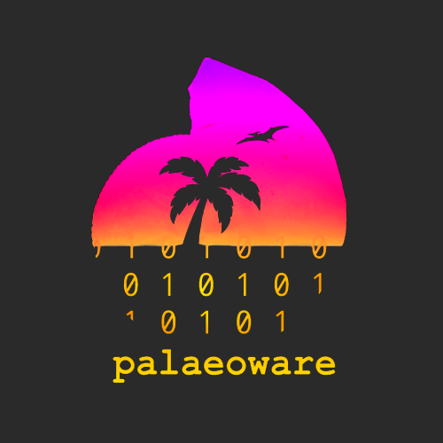

# REVoSim and EnviroGen
## [R]apid [EVO]lutionary [SIM]ulator and [Enviro]nment [Gen]rator

Coded by:
 - Mark Sutton (m.sutton@imperial.ac.uk)
 - Russell J. Garwood (russell.garwood@gmail.com)
 - Alan R.T. Spencer (alan.spencer@imperial.ac.uk)

  

______

## Relevant references:
Garwood, R.J., Spencer A.R.T. and Sutton, M.D., 2019. REvoSim: Organism-level simulation of macro- and microevolution. Palaeontology.
_____

CONTENTS:

1. Copyright and Licence
2. Introduction
3. Installation
4. Minimum Requirements
5. Documentation
6. Contributing to the code
7. Bug reporting and feature requests

_____

## 1. Copyright and Licence

All REvoSim and utility code (EnviroGen) is released under the GNU General Public License. See LICENSE.md files in the programme directories.

This program is free software; you can redistribute it and/or modify it under the terms of the GNU General Public License as published by the Free Software Foundation; either version 3 of the License, or (at your option) any later version. This program is distributed in the hope that it will be useful, but **without any warranty**.

_____

## 2. Introduction

REvoSim is an evolutionary model that aims to bridge the epistemological gap between micro- and macroevolution by providing an organism-level simulation of sufficient computational efficiency that population sizes of 105-106 individuals can be studied over geological timescales. The model also incorporates concepts of spatial relationships, spatial and temporal environmental variation, and recombinant reproduction. Isolation of gene-pools (i.e. speciation) is not enforced, but emerges naturally from simulations under appropriate conditions. We intend REvoSim as a multipurpose platform for the study of many evolutionary phenomena; while it was designed with macroevolutionary studies in mind, it is also applicable to microevolutionary problems.

EnviroGen is an environment generator for the REvoSim software, which allows highly customised image stacks to be created using a number of different algorithms.

_____

## 3. Installation

REvoSim and utility code may be compiled using QT from the source code or installed from the binary releases on our [GitHub](https://github.com/palaeoware).

_____

## 4. Minimum Requirements

REvoSim and utility code will run on any modern desktop/laptop: we recommend a minimum of 1GB RAM and a 1.8 GHz or faster, ideally multicore processor. We also recommend a minimum screen resolution of 1280x720 if using the software without the genome comparison docker (and 1920x1080 if this is enabled).

_____

## 5. Documentation

All documentation for REvoSim is online at [http://revosim.readthedocs.io/](http://revosim.readthedocs.io/). This is a version controlled user manual automatically parsed from the .rst found under the docs folders in our software folders. EnviroGen documentation is managed in the same way, and can be found at [http://envirogen.readthedocs.io/]((http://revosim.readthedocs.io/).
_____

## 6. Contributing to the code

Contribution to the code in this repository is welcome. Please read the [Repository Contribution](https://github.com/palaeoware/repoconventions)  document for a guide to our coding style and repository structure before submitting any code updates.

_____

## 7. Bug reporting and feature requests

Bug reporting and feature requests should be made through the [GitHub Issues](../../issues) page for this repository. We will aim to respond to all issues and feature requests in a timely manner.

_____

t:@palaeoware

e:palaeoware@gmail.com

w:https://github.com/palaeoware
