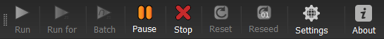

.. _maintoolbar:

Main Toolbar
============

The main toolbar consists of the following buttons:

    Figure 3.1.2.1 - Main toolbar (no simulation running).

    Figure 3.1.2.2 - Main toolbar (with simulation running).

The first four (“Run”, “Run for”, “Batch”, "Pause" and “Stop”) control the initiation and cessation of simulation runs. These commands can also be accessed from the :ref:`mainmenu-commands` menu.

:Run: This button launches a simulation, and then runs it until it is either pasued or stopped.
:Run for: This launches a simulation and runs it for a user-defined number of iterations.
:Batch: For repeated runs using the same settings, REvoSim provides a batch mode: this provides the option of repeating the environment, or continuing from the last environmental file loaded. Logs in batch mode will be labelled accordingly. The number of runs, and for how many iterations these should last, are requested on launching batch mode.
:Pause: Pauses a simulation, allowing it to be continued when requested.
:Stop: Stops a simulation and resets the GUI, but leaves the simulation in its current state.
:Reset: Resets the simulation by removing all digital organisms, and then placing a random individual capable of surviving in the central pixel.
:Reseed: Launches a dialogue to allow the simulation to be reseeded with a known genome, or with two individuals that share a (random, or user-defined) genome. Not all genomes are capable of surviving in a REvoSim run: if reseeded with a geome incapable of survival, REvoSim will provide an error. To allow reseeding with a known genome - but one which can survive in a given environment, the dialogue provides a list comprising the top ten genomes from the genome comparison dock (which can be populated prior to a given run). See :ref:`genomecomparison`.
:Genome: Launch Genome Comparison Dock, described in :ref:`genomecomparison`.
:Settings: Launch Settings Dock which allows variables to be defined. See  :ref:`organisms`, :ref:`simulations` and :ref:`outputs`.
:About: Launch dialogue with information about REvoSim, including version number, authors, license information, and contact details for the Palaeoware team.

The toolbar itself can be moved to one of four available positions using drag and drop: top (default), left, right, and bottom of the window. The toolbar can also be undocked from the main window and used as a floating toolbar (i.e. an independent window). To move the toolbar or to undock it as a floating window use the left mouse button on the three dotted handle (far right of the toolbar by default), then holding the mouse button down drag the window to it desired position.
