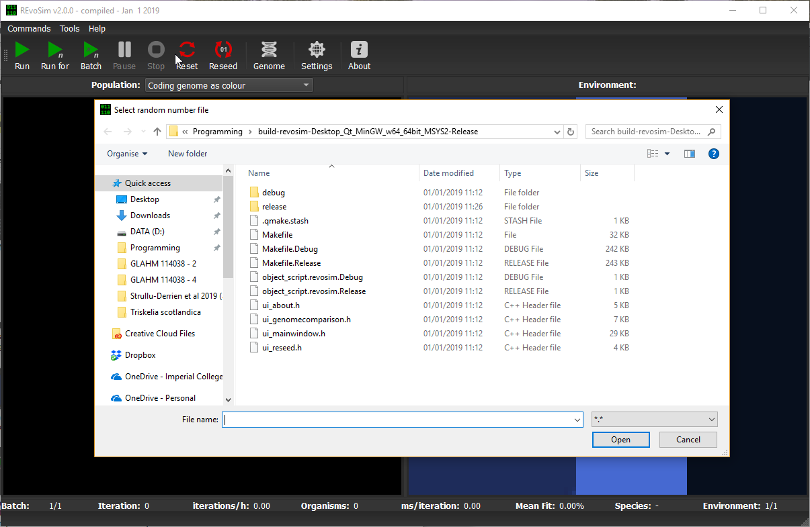
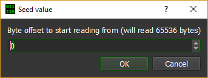

.. _customrandomnumbers:

Custom Random Numbers
=====================

REvoSim employs a pre-generated table of 65,536 random numbers 0–255 which it uses by default during the simulation, both for speed and to avoid potential biases from pseudo-random number generators. 10Mb of quantum-generated random numbers from `randomnumbers.info <http://www.randomnumbers.info>`_ are packaged into the executable and used to generate this table on load (i.e. different runs will have different random numbers, based on the quantum-generated random numbers); these can be replaced with any other random number file preferred by the user.

To load a custom file of random numbers use the ‘Commands > Load Random Numbers…’ command from the main menu to open a file selection dialog.

    Figure 9.2.1 - Custom Random Number file open dialog.

The random number file should be encoded as a random binary string, and should be a minimum of 65536 bytes. Once the desired file is selected press the ‘Open’ button to import the new random numbers. REvoSim will then ask for a byte offset to read the file from (thus allowing runs to be repeated with the same random numbers, if desired).

    Figure 9.2.3 - Custom Random Number byte offset form.

Note that REVOSIM will always read 65536 bytes; and will throw an error message if it cannot.

.. figure:: _static/randomNumberError.png
    :align: center

    Figure 9.2.3 - Custom Random Number error on load message.

On success a pop-up message reading “New random numbers read successfully” will appear.
