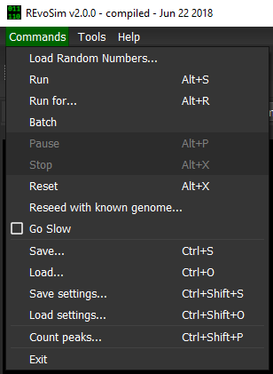
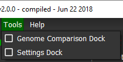
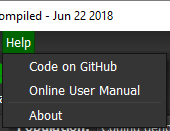

.. _mainmenu:

Main Menu
=========

The Main Menu, located at the top of the program window, allows access to all program actions, functions, and settings. The menu is currently sub-divided into three sections:

1. :ref:`mainmenu-commands`
2. :ref:`mainmenu-tools`
3. :ref:`mainmenu-help`

.. _mainmenu-commands:

Commands
--------

The Commands menu holds the majority of available actions and program functions related to running of one or more simulations. The options are as follows:

:Load Random Numbers: Allows the random numbers incorporated into the REvoSim binary to be overridden with a custom file. See :ref:`customrandomnumbers`.
:Run .... Reseed with known: These options are provided as alternatives to the buttons on the top toolbar of the GUI.See :ref:`maintoolbar`.
:Go slow: This option slows the simulation to allow environmental changes and the visualisation in the population view to be viewed more clearly. It achieves this by adding a 30ms delay to every iteration.
:Save: This saves the current state of the REvoSim simulation, allowing it to be loaded later, including the masks, organisms, and all settings. This is saved as a binary file to allow the minimum file size possible.
:Load: This loads the above REvoSim file.
:Save settings: This saves the settings of REvoSim in a given state. This includes all user-defined variables, but nothing else. These are saved as a human-readable XML file.
:Load settings: Loads a settings file.
:Count peak: This is provided to help the user understand the fitness landscape of their run (albeit in simple terms). See :ref:`countpeaks`.
:Exit: Quits REvoSim.

.. _mainmenu-tools:

Tools
-----

The Tools menu allows access to the built-in dockable widgets (called 'Docks') which alter or extend the core program functions. This includes the main simulation settings dock, described in :ref:`organisms`, :ref:`simulations` and :ref:`outputs`, and the genome comparison dock (:ref:`genomecomparison`).

.. _mainmenu-help:

Help
----

The Help menu contains links to useful program information, the Palaeoware code repository, and the REvoSim documentation.
