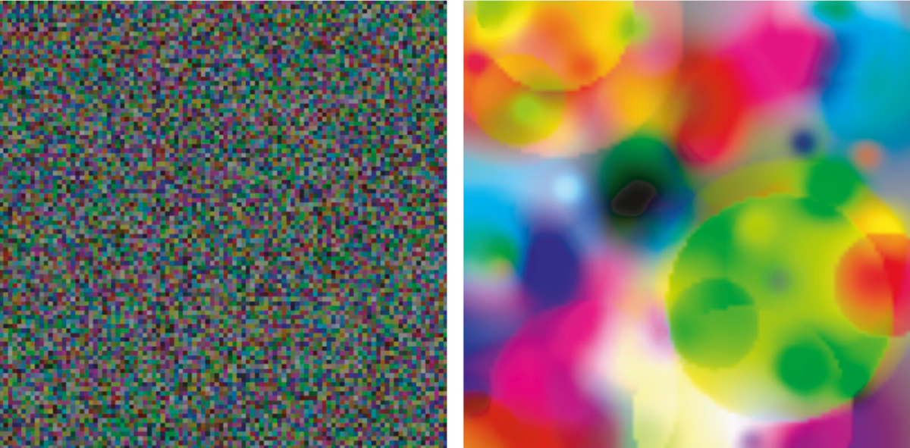

.. _revosimconcepts:

Concepts and Example Usage
==========================

Concepts
--------

There are a number of underlying concepts that are useful to consider when using REvoSim. Please bear in mind that the model itself is fully described in the publications listed on the :ref:`Introduction` page. Prior to publishing any work using the software, or for more details on the following, please do check these out. To see how the software fits into the wider field, the paper `Digital Evolution for Ecology Research: A Review <https://www.frontiersin.org/articles/10.3389/fevo.2021.750779/full>`_ provides a useful overview.

If it would be beneficial to have further concepts outlined below, please contact the authors. 

**Species concept**

REvoSim is an individual-based simulation, and thus during runs population(s) of digital organisms evolve under a set of rules. As they evolve, species can emerge. These are stem from the species concept employed by REvoSim which is based upon reproductive isolation, and is thus akin to the biological species concept. The implementation of this (the species algorithm) is described in the `2019 paper <https://doi.org/10.1111/pala.12420>`_ documenting the model, but involves a pairwise comparison of all individuals within a simulation every polling iteration to identify reproductively isolated clusters, and then a tracking function between these iterations. The level of dissimilarity required for reproductive isolation to occur is under user control: the option Maximum difference to breed dictates how many bits different two genomes are before they are considered isolated by this algorithm. Lowering this number creates more speciation-prone simulations.

Within this framework, runs in REvoSim - that typically start with a single genome - also start with a single species, that will go on to dominate the simulation. As a simulation runs, however, the population evolves, and under most settings species start to appear when populations specialise to a point when none can interbreed with any other organism alive within the simulation. Sometimes these will be sympatric (i.e. they occur in a single block of colour) but often, as a simulation runs, species will evolve in, and then start to track, particular colours (~niches) in their environment.

**Time**

Time in a REvoSim simulation is measured in iterations. Every iteration, the algorithms that comprise the model are completed once. In order to link this to real world time units, it is useful to consider the average time per generation. Exactly how iterations map to real time, however, depends on the settings you use for any given run. You can investigate this using REvoSim's :ref:`Logging` system: the \*gridGeneration\* tag can be used for any settings to calculate and output the average age of all organisms successfully breeding in a polling iteration. This works on the assumption -- which is true for the majority of settings -- that organisms will breed once in their lifetime. This assumption can be tested (and a correction factor calculated and applied if so desired) by using the \*gridNumberAlive\* and \*gridBreedSuccess\* log outputs to calculate the proportion of breeds for the grid per unit population.

Using this approach demonstrates, for example, that the average generation time for default REvoSim settings is between 11 and 12 iterations. 

Example Usage
-------------

Setting up REvoSim simulations to test particular eco-evolutionary hypotheses involves several steps. This page will guide you through setting up simulations to test the "more-individuals" hypothesis of species richness: the hypothesis that the species richness of ecosystems is controlled by the number of individuals that they contain. REvoSim is used to test this hypothesis in `Furness et al. (2021) <https://onlinelibrary.wiley.com/doi/10.1002/ece3.7730>`_.

**Is REvoSim suitable?**

A variety of different tools exist to simulate eco-evolutionary processes under different environmental conditions (see `Dolson & Ofria (2021) <https://www.frontiersin.org/articles/10.3389/fevo.2021.750779/full>`_ for a review). Each one of these tools makes trade offs between complexity and computing efficiency, and so each will be suitable for answering different research questions. As an individual-based eco-evolutionary simulator, optimised to operate over geological timescales, REvoSim is relatively well placed to test hypotheses regarding the process of speciation within large populations. It is therefore suitable to investigate the "more-individuals" hypothesis, but be aware that other tools, such as gen3sis, may be more appropriate if the phenomena of interest are operating at the level of the population, rather than the individual.

**Choosing logging options**

In order for our REvoSim runs to produce useful data, we must select appropriate logging options before running any simulations. The "v2.0.0 log" option provides a useful default choice for log content, which includes species richness in every logged iteration and the total number of organisms alive in each logged iteration. The v2.0.0 log is therefore suitable for testing the more-individuals hypothesis, and also serves as a useful starting point for building a logging output in general. We must also check the "write to file" box, in order to produce a log in each experiment, and we must specify a directory to which the log is to be written.

**Choosing an environment**

REvoSim's default environment of three vertical blue bars is useful as a tool for demonstrating adaptation of organisms to specific environments. However, it is not a very realistic environment: it contains three distinct habitat types (i.e.colours), with no gradational change between colours and no temporal variability. We might wish to replace it with a more realistic environment, such as a lights-type environment generated by the EnviroGen tool. Alternatively, we might wish to replace the default environment with an environment designed to maximise species richness, such as a noise environment from the EnviroGen tool, so that we can more easily observe any effects of the number of individuals on the number of species. In the course of a research project, we probably want to run simulations using both of these options.

    Above: examples of the noise (left) and lights (right) environments from EnviroGen.

**Choosing simulation settings**

The default settings in REvoSim have been shown to produce realistic evolutionary phenomena such as adaptation towards fitness peaks. Consequently, choosing simulation settings for experiments in REvoSim is usually as simple as modifying settings that are to be treated as variables in the experiments while leaving other settings as defaults. To test the more-individuals hypothesis, we need to vary the number of individuals in the simulation, which means varying the energy supplied to the organisms in the simulation for reproduction. We can control this by changing the "energy input" setting from its default of 2000 to either, for example, a low value of 1000 or a high value of 4000examples. We may also wish to change the "environment mode" setting: the "bounce" setting works well with lights-type environments, and "static" may be appropriate for a noise environment if we want to allow for the highest possible species diversity.

**Running the simulation**

Now that our logging options are set, our environment is chosen, and our settings are modified as required, we need to run the simulation. To ensure that all is functioning as intended, or if only a few runs are needed, we can use the "Run for" button in the GUI. This will produce a dialogue box that asks us how many iterations we want to run our simulation for. Generation times under default settings are 10-15 iterations, so 50,000 iterations, representing as many as 5,000 generations, is likely to be sufficient to reach equilibrium. While the simulation runs, it will continuously write logging information to a text file (REvoSim_output.txt) in the specified logging directory.

If we want to run a large number of replicate simulations, then running each individually would take a lot of effort. The "Run Batch" button allows us to run several identical simulations back-to-back, outputting logs for each. Alternatively, if we want to run a large number of simulations with slightly different settings (for example, slightly different energy levels, representing a gradient from high to low energy), we can use REvoSim's :ref:`commandline`. Below is an example of a single instruction to the command line in the Windows operating system that runs a REvoSim simulation. It will do so with a non-default environment (whatever images are in the folder at the filepath following the "-e" tag) and non-default simulation settings ("-m Static" means that the environment will not change over time, "-n 4000" means that the simulation will have an energy input of 4000 units, "-v2log True" means that the simulation will produce a v2.0.0 log output to the filepath specified after the "-j" tag, and "-auto 50000" means that the simulation will end after 50000 iterations have elapsed):

.. code-block:: console

  C:\Users\Guest\Desktop\revosim\bin\revosim.exe -e C:\Users\Guest\Desktop\Folder_Containing_Environment_Files\ -j C:\Users\Guest\Desktop\Folder_To_Store_Output -m Static -n 4000 -v2log True -auto 50000

This command line approach is often the most useful for running actual experiments in REvoSim, because of its ability to modify variables along a gradient.

**Processing logs**

REvoSim is relatively flexible in terms of the format of the logs it produces. However, some processing of these logs will be necessary in order to visualise or analyse the data that they contain. REvoSim does not include any software for this processing, but since logs are output as text files, they can be easily manipulated by a variety of other tools. String handling in Python, or any other appropriate coding language, is a straightforward way of converting data in the REvoSim log file into a useable dataset. Examples of this code can be found in the supporting information of Furness et al. (2021), but keep in mind that different logging setups will require different processing code (and note also with the custom log functionality, logs can be output as e.g. csv files to be loaded into spreadsheet software if desired).

By writing a short piece of code that extracts from each REvoSim log file the number of species and number of individuals present in each REvoSim simulation in its final iteration, we can build up a picture of the relationship between these two variables. This allows us to directly test the predictions of the more-individuals hypothesis.