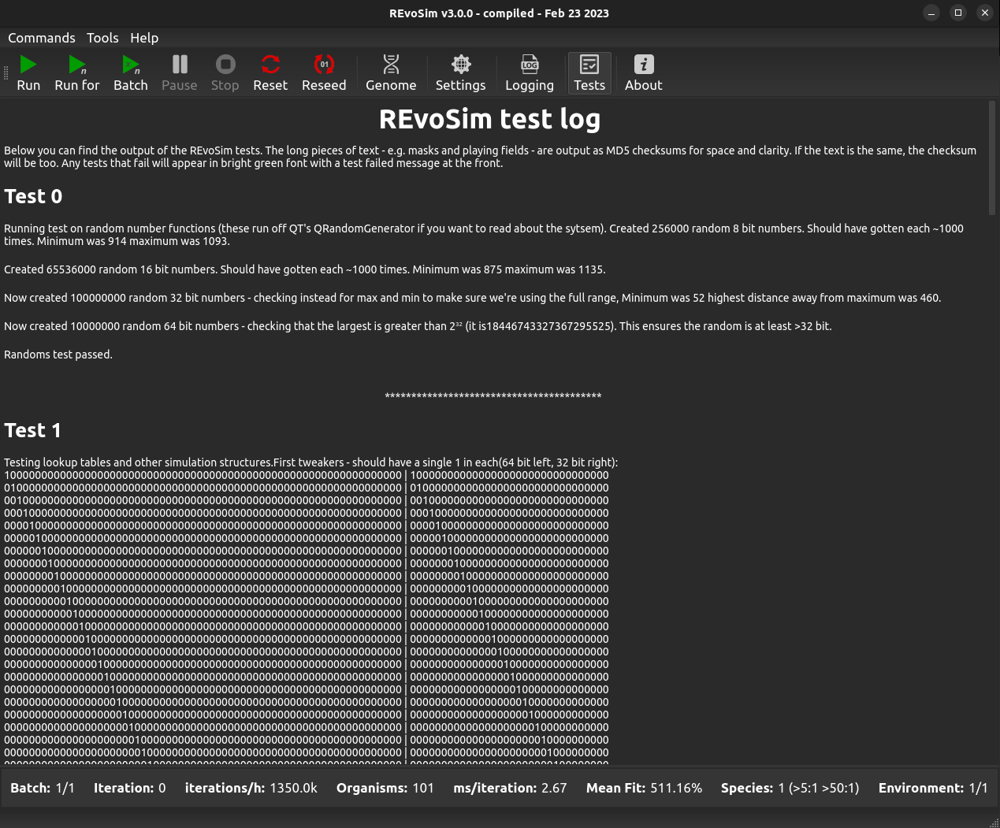

Tests
=====

REvoSim has a test mode which is toggled by hitting the Tests button on the menu bar. This runs a series of software tests and then displays the output within the REvoSim main window (the Test Log). The GUI of the software when in test mode is shown below.

    REvoSim main window in test mode.

REvoSim test log
----------------

Our chosen approach allows all users to visually inspect the outputs of the tests if they so wish, even if they are not able to build the software themselves. Tests that fail will appear in bright green font with a test failed message at the front. If you are using the software for your research, please do feel free to inspect the test outputs and contact the authors with any queries. 

The expectations of each test, as well as the results, are written to a test log. Outputs are generally either numbers, or text strings which should be identical. The latter are output as MD5 checksums for space and clarity (if the text is the same, the checksum will be too). Each test generally comprises multiple components testing the different elements of a logically connected element of the software. An annotated example of one of these is shown below. 

Test zero - Annotated output
~~~~~~~~~~~~~~~~~~~~~~~~~~~~

As an example of one of REvoSim's test, we use here test zero - which ensures REvoSim's random numbers are working as expected. The output is as follows:

    Running test on random number functions (these run off QT's QRandomGenerator if you want to read about the system).

Many tests will provide useful information regarding the functioning of the underlying elements -- in this case, REvoSim's random numbers rely upon the `QRandomGenerator class <https://doc.qt.io/qt-5/qrandomgenerator.html>`_ of the Qt framework.

    Created 256000 random 8 bit numbers. Should have gotten each ~1000 times. Minimum was 914 maximum was 1093.

The first element of the test ensures an even spread of random 8 bit numbers, and reports the outputs. The outputs will vary, but will numbers within sensible bounds will allow the test to pass.

    Created 65536000 random 16 bit numbers. Should have gotten each ~1000 times. Minimum was 875 maximum was 1135.

The second element of the test ensures an even spread of random 16 bit numbers, and reports the outputs. 

    Now created 100000000 random 32 bit numbers - checking instead for max and min to make sure we're using the full range, Minimum was 52 highest distance away from maximum was 460.

    Now created 10000000 random 64 bit numbers - checking that the largest is greater than 2\ :sup:`32` (it is18446743327367295525). This ensures the random is at least >32 bit.

REvoSim also relies on longer random numbers. In the interests of speed, the tests change from checking for an even spread, to ensuring that in a large number of randoms, the minimum and maximum are close to the bounds of the number. 

    Randoms test passed.

As long as all of the individual parts of a test pass, the test as a whole does.

Failed Tests
------------

If a test fails, the outputs appear in green with a failure message at the top, and message at the bottom highlighting explaining what has failed.

.. figure:: _static/test_failed.png
    :align: center

    A failed REvoSim test. Don't panic, it's in the development branch.