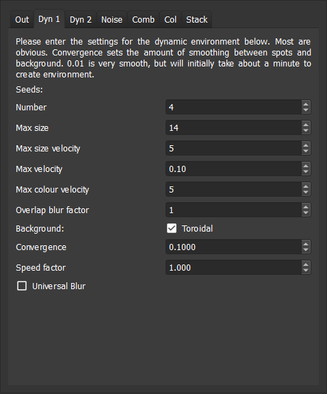
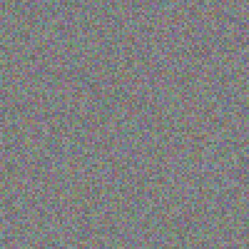
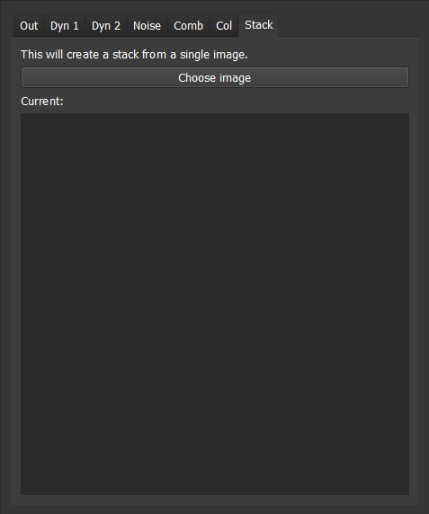

.. _options:

EnviroGen options
=================

Within the Settings dock of EnviroGen are a number of different modes of creating / modifying environments. All can be accessed by changing the chosen tab at the top of this dock. The tabs are introduced below.

Out
---

.. figure:: _static/settings_out.png
    :align: center

This tab has EnviroGren output options.

:Save images: When checks images are saved as .pngs into a folder called  *EnviroGen_output* in the output folder. If the folder and files it contains already exists, EnviroGen overwrites any older files with file name conflicts.
:Save location: This defines the location in which the above folder is created - it is, by default, the desktop in all operating systems.
:Change: Launches a file dialogue to change the save location.
:Generate for: Defines the number number of environmental images created.
:Image size: This dictates the size of the image files created.
:Environment type: The type of environment generated is defined using this dropdown menu. When changing to any other tab, the selected environment change is changed here to reflect the current tab, and thus when Run is selected on any other tab, that environment type is generated.
:Resize image: If selected this resizes the image to fill the GUI (but does not alter the size of the image that is created, as defined in image size).

Dyn 1
-----

EnviroGen provides two primary models for the creation of dynamic environment. The first employs a user-defined number of seeds of varying colours and sizes, which drift across the environmental image. A Laplacian smooth is used to define the colour between these seed points.

The following options are provided to control the environment:

:Number: This is the number of seeds which are used to create the environment.
:Max size: This defines the maximum size these seeds can achieve, in pixels.
:Max size velocity: By default the size of the seeds changes over the course of a run. This option dictates the maximum change in size any given iteration in pixels. Setting it to zero will stop the seeds changing in size (by they will still initialise at different sizes).
:Max velocity: This defines the maximum velocity of the seeds in terms of their movement across the grid in pixels/iteration. Note that these are soft limits - the seeds can exceed these, but will generally move towards the maximum in any direction if it is above this figure.
:Overlap blur factor: When two seeds overlap, this option defines the amount of blurring in the overlapping region. A setting of one ensures that overlapping pixels smooth. Larger than this creates a square zone of blurring around the overlapped sections: at very large values this could create changes to the whole environment when seeds overlap.
:Toroidal: When this option is checked, the environment wraps around to avoid boundary effects. Seeds that disappear from one side will appear from the other - the same is true of top and bottom.
:Convergence: This defines the extent to which the Laplacian smooth creates gradients between seeds - the smaller the number, the smoother the gradients (but the longer the smooth takes to covnerge, especially for the first environmental image).
:Speed factor: This is a convenience option allowing the simulation to be changed only in speed: not any other factor. This option is a multiplier for all velocities.
:Universal blur: By default the Laplacian smooth only creates gradients *between* the seeds. When this option is selected the seeds define pixel colours, but then the smoothing smooths over these, as well as the space between seeds.

An example environment created with dynamic environment one is shown below.

.. figure:: _static/Dyn_01.png
    :align: center

Dyn 2
-----

.. figure:: _static/settings_dyn2.png
    :align: center

The second model for generation of dynamic environments is also based on moving seeds, but differs in being additive, and lacking smoothing. Seeds, or objects, have a sizes, colours and velocities, and changes ("accelerations") are applied to these. Limits can be placed on values, their first derivative (e.g. velocity), or their second derivative (e.g. acceleration). Dynamic environment two tends to have higher gradients between pixels than the first, and using the default settings it changes more rapidly. It is quicker generating environments than dynamic environment one. Options are as follows:

:Object count: This is the number of seeds which are used to create the environment.
:Maximum object size: The maximum possible object size. In this dynamic environment all limits are hard, and thus cannot be exceeded.
:Minimum object size: This is the minimum size.
:Maximum tightness: Tightness controls the rate at which the colour-influence of each seed drops off away from its centre. High tightness values produce a rapid drop-off - i.e. the colour influence is more tightly concentrated near its centre. Maximum tightness is the hightest value this can reach
:Minimum tightness: The minimum tightness value (see above).
:Maximum ... velocity: There then follow options to provide a hard limits to the velocity of the objects, and also a maximum to the rate of change of their colour, size and tightness.
:Maximum ... acceleration: The next four options allow limits to be placed on the rate of change of the rate of change of velocity, size, tightness and colour.
:Speed factor: As with dynamic environment one, there is a multiplier allowing environmental settings to be repeated with the only difference being rate of change (i.e. all are multiplied by this factor).
:Apply accelerations every...: Within this dynamic environment accelerations do not need to be applied every iteration. Rather than can be applied.

An example environment created with dynamic environment two is shown below.

.. figure:: _static/Dyn_02.png
    :align: center

Noise
-----

.. figure:: _static/settings_noise.png
    :align: center

To study some phenomena a level of noise on an environment may be desirable. This tab creates a noise image using 10Mb of quantum-generated random numbers from `randomnumbers.info <http://www.randomnumbers.info>`_ that are packaged into the executable. These are loaded on program launch from a starting point based on a pseudorandom number, seeded on the time at launch. These can then be combined with any other environment as required using the comb tab. It creates random R,G, and B values for every pixel within the limits desired, and offers two options:

:Minimum value: This is the minimum value for the noise (i.e. the minimum value any R, G or B value can take).
:Maximum value: The maximum value.

An example noise environment is shown below.

Combine
-------

.. figure:: _static/settings_comb.png
    :align: center

This allows image stacks to be combined or concatenated, and thus allows the construction of increasingly complex environments. It takes two input stacks, and allows the influence of each while they are being combined to be defined. RGB values for both stacks are added. If they are limited to a maximum of 255, and an 8 bit image is output. Options are as follows:

:Stack one: This is the first image stack. The change button opens a file dialogue and allows a folder to be selected, the location of which appearshere.
:Stack two: As above, but the second image stack.
:Start slice: EnviroGen combines image stacks from this slice (note it employs C++ numbering, so zero is the first slice, etc.). Before this point, if this is not zero, it will merely copy stack one. If stack one ends before the last image in stack two, it will copy stack two to the end. Stacks can be concatenated by setting the starty slice to the size of stack one.
:Percent influence: Percentage start and end dictate influence of stack one for slices which are combined; the programme interpolates between these percentages, allowing smooth or abrupt changes in the combined region as required.

Note that if "generate for" in the output tab is set to be higher than the number of images tab one, or start slice plus tab two, EnviroGen will generate black environmental images for the remainder of the run.

Col
---

.. figure:: _static/settings_col.png
    :align: center

This is a convenience function to create an image stack comprising a single colour (which can they be combined with other images if desired). The colour can be set either by entering red blue and green levels into the spin boxes on this tab, or using the colour picker.

Stack
-----

This tab allows a stack to be created from a single image. Choose image launches a file dialogue, and once an image has been chosen, it is converted to a stack and placed in the output folder.
